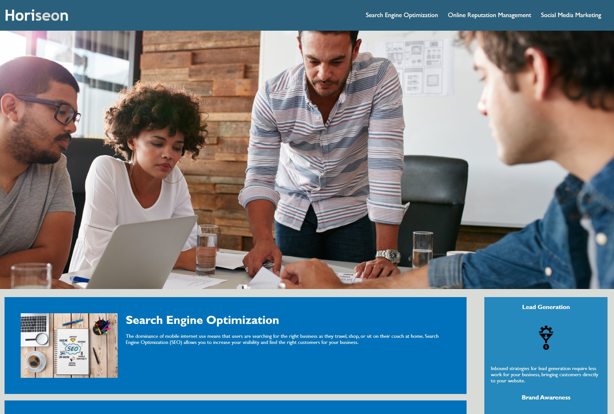

 

# Horiseon

## Table of Contents

1. [Technology](#technology)
2. [Summary](#Summary)
3. [Changelog](#Changelog)
3. [Author](#Author)

 

## Technology
- HTML - Creates text and differents elements 
- CSS - styles html elements on page
- GitHub - hosts and deploys the pages
- Bash - Terminal
 

 

## Summary 
This is the homepage of Horiseon's website.
They specialize in SEO, Reputation managment, and social media Marketing.
 

 

## Changelog
### 2021-3-18
- Restructure HTML5 to meet Semantic norms
- Comment CSS and made more clear
- Add alt attribute to all img tags 
- Add page title
 

 

## Author
[LinkedIn](https://www.linkedin.com/in/dcouzon/)
[GitHub](https://github.com/Dylancouzon)
